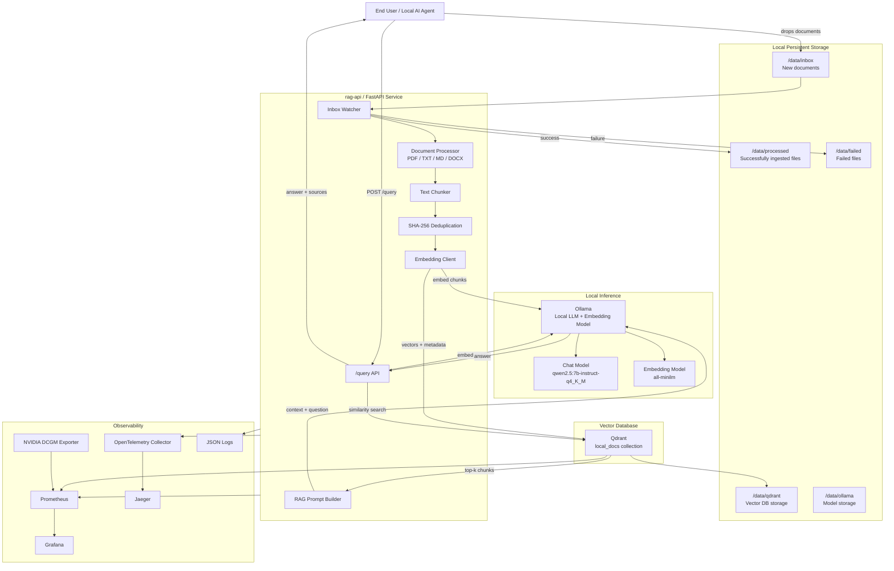
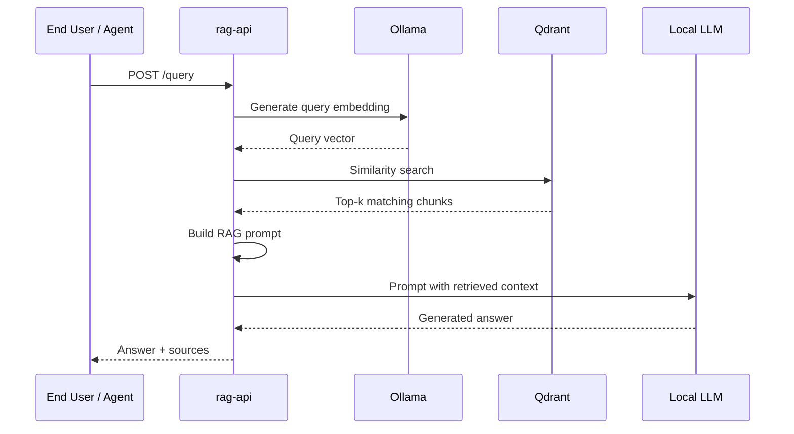
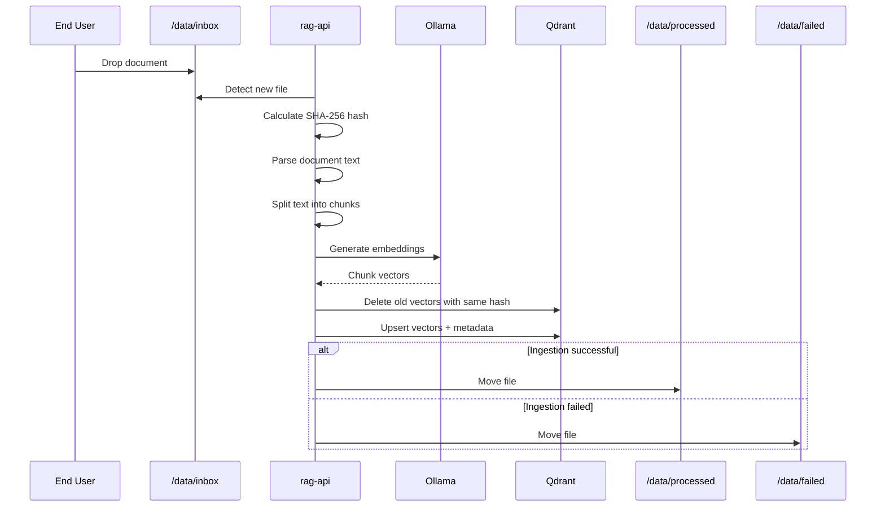

# Local RAG Pipeline

An MVP for a local-first Retrieval-Augmented Generation infrastructure for running contextual document search and question answering on a home Unix server.

This project allows users to drop documents into a local `inbox` directory. The system automatically detects, parses, chunks, embeds, and stores those documents in a local vector database. A local AI agent can then query the database, retrieve relevant context, and inject that context into a locally hosted LLM.

The stack is designed to run fully offline after initial model/container downloads.

---

## Features

* Local document ingestion from an `inbox` directory
* Support for common document formats:

  * `.txt`
  * `.md`
  * `.pdf`
  * `.docx`
* Automatic text extraction and chunking
* Local embedding generation
* Vector storage using Qdrant
* Local LLM inference using Ollama
* RAG query endpoint for AI agents
* File de-duplication using content hashing
* Processed and failed file handling
* Docker Compose orchestration
* Prometheus-compatible metrics
* NVIDIA GPU monitoring via DCGM Exporter
* OpenTelemetry tracing support
* Structured JSON logging

---

## Intended Hardware

This project is designed for modest local GPU servers, for example:

* NVIDIA GTX 1080 Ti, 11 GB VRAM
* 32 GB system RAM
* Unix/Linux host
* Docker and Docker Compose
* NVIDIA Container Toolkit

The recommended model configuration is conservative so that the LLM and embedding workload can run within limited VRAM.

---

## Recommended Model Setup

Default recommended models:

```bash
ollama pull all-minilm
ollama pull qwen2.5:7b-instruct-q4_K_M
```

Recommended configuration:

```text
Embedding model: all-minilm
LLM: qwen2.5:7b-instruct-q4_K_M
Vector DB: Qdrant
Inference runtime: Ollama
API service: FastAPI
```

For small local document collections, `all-minilm` is a practical default because it is fast and lightweight.

---

## Architecture



### Query Flow



### Ingestion Flow



---

## Repository Layout

```text
local-rag/
├── docker-compose.yml
├── .env
├── rag-api/
│   ├── Dockerfile
│   ├── requirements.txt
│   └── app/
│       ├── main.py
│       ├── config.py
│       ├── ingest.py
│       ├── parser.py
│       ├── chunking.py
│       ├── embeddings.py
│       ├── vectorstore.py
│       ├── rag.py
│       ├── logging_config.py
│       └── telemetry.py
├── data/
│   ├── inbox/
│   ├── processed/
│   ├── failed/
│   ├── qdrant/
│   └── ollama/
├── observability/
│   ├── prometheus.yml
│   └── otel-collector.yml
└── scripts/
    ├── pull-models.sh
    └── test-query.sh
```

---

## Services

### `rag-api`

The main application service.

Responsibilities:

* Monitor the inbox directory
* Parse documents
* Split text into chunks
* Generate embeddings
* Store vectors and metadata in Qdrant
* Expose a RAG query API
* Emit logs, metrics, and traces

### `ollama`

Runs the local LLM and embedding model.

Used for:

* Chat completion
* Embedding generation

### `qdrant`

Local vector database.

Stores:

* Vector embeddings
* Chunk text
* File metadata
* Content hashes
* Source filenames
* Chunk IDs

### `prometheus`

Collects application and GPU metrics.

### `grafana`

Optional dashboarding layer for metrics visualization.

### `dcgm-exporter`

Exposes NVIDIA GPU metrics for Prometheus.

### `otel-collector` and `jaeger`

Collect and visualize distributed traces.

---

## Requirements

Host requirements:

* Linux or Unix-like host
* Docker
* Docker Compose
* NVIDIA GPU driver
* NVIDIA Container Toolkit
* At least 16 GB RAM
* Recommended: 32 GB RAM
* Recommended GPU: 8 GB+ VRAM
* Target GPU: NVIDIA GTX 1080 Ti or similar

Check GPU visibility:

```bash
nvidia-smi
```

Check Docker GPU passthrough:

```bash
docker run --rm --gpus all nvidia/cuda:12.4.1-base-ubuntu22.04 nvidia-smi
```

---

## Quick Start

### 1. Clone the repository

```bash
git clone https://github.com/YOUR_USERNAME/local-rag.git
cd local-rag
```

### 2. Create required directories

```bash
mkdir -p data/inbox data/processed data/failed data/qdrant data/ollama data/grafana
```

### 3. Start the stack

```bash
docker compose up -d --build
```

### 4. Pull local models

```bash
docker exec -it rag-ollama ollama pull all-minilm
docker exec -it rag-ollama ollama pull qwen2.5:7b-instruct-q4_K_M
```

### 5. Add a document

Copy a document into the inbox:

```bash
cp ~/Documents/example.pdf ./data/inbox/
```

The ingestor will detect the file and process it automatically.

### 6. Query the RAG API

```bash
curl -X POST http://localhost:8080/query \
  -H "Content-Type: application/json" \
  -d '{"query": "Summarize the uploaded document."}'
```

---

## API Reference

### Health Check

```http
GET /health
```

Example:

```bash
curl http://localhost:8080/health
```

Response:

```json
{
  "status": "ok"
}
```

---

### Manual Ingestion

```http
POST /ingest
```

Forces a scan of the inbox directory.

Example:

```bash
curl -X POST http://localhost:8080/ingest
```

---

### Query

```http
POST /query
```

Request:

```json
{
  "query": "What does the document say about backup retention?"
}
```

Example:

```bash
curl -X POST http://localhost:8080/query \
  -H "Content-Type: application/json" \
  -d '{"query": "What does the document say about backup retention?"}'
```

Response:

```json
{
  "answer": "The document states that...",
  "sources": [
    {
      "filename": "example.pdf",
      "chunk_id": 3,
      "score": 0.82
    }
  ]
}
```

---

## Environment Variables

The `rag-api` service can be configured using environment variables.

| Variable          |                      Default | Description                 |
| ----------------- | ---------------------------: | --------------------------- |
| `OLLAMA_BASE_URL` |        `http://ollama:11434` | Ollama API endpoint         |
| `QDRANT_URL`      |         `http://qdrant:6333` | Qdrant API endpoint         |
| `COLLECTION_NAME` |                 `local_docs` | Qdrant collection name      |
| `EMBEDDING_MODEL` |                 `all-minilm` | Ollama embedding model      |
| `LLM_MODEL`       | `qwen2.5:7b-instruct-q4_K_M` | Ollama chat model           |
| `VECTOR_SIZE`     |                        `384` | Embedding vector size       |
| `INBOX_DIR`       |                `/data/inbox` | Watched inbox path          |
| `PROCESSED_DIR`   |            `/data/processed` | Successfully ingested files |
| `FAILED_DIR`      |               `/data/failed` | Failed files                |
| `CHUNK_SIZE`      |                        `700` | Chunk size in characters    |
| `CHUNK_OVERLAP`   |                        `120` | Chunk overlap in characters |
| `TOP_K`           |                          `5` | Number of retrieved chunks  |

---

## Document Ingestion Flow

```text
file deposited
  -> detect file
  -> calculate SHA-256 hash
  -> parse text
  -> split into chunks
  -> generate embeddings
  -> delete previous vectors with same content hash
  -> upsert new vectors into Qdrant
  -> move file to processed
```

If processing fails:

```text
file deposited
  -> error occurs
  -> file moved to failed
  -> failure logged
```

---

## Duplicate File Handling

The default duplicate policy is:

```text
Same content hash detected:
- Delete old vectors for that content hash
- Insert the new vectors
- Move file to processed
```

This keeps the vector database clean and avoids duplicate search results.

---

## Observability

### Metrics

Prometheus-compatible metrics are available at:

```http
GET /metrics
```

Example metrics:

```text
rag_documents_ingested_total
rag_documents_failed_total
rag_query_latency_seconds
rag_ingestion_latency_seconds
rag_inbox_queue_size
```

GPU metrics are exposed through NVIDIA DCGM Exporter.

### Logs

Application logs should be emitted as structured JSON.

Recommended fields:

```json
{
  "timestamp": "2026-01-01T12:00:00Z",
  "level": "INFO",
  "service": "rag-api",
  "event": "document_ingested",
  "filename": "example.pdf",
  "chunks": 12,
  "elapsed_seconds": 2.41
}
```

### Tracing

OpenTelemetry traces should cover:

Document lifecycle:

```text
file_detected
  -> parse_document
  -> chunk_document
  -> generate_embeddings
  -> qdrant_upsert
  -> move_to_processed
```

Query lifecycle:

```text
query_received
  -> embed_query
  -> qdrant_search
  -> build_prompt
  -> ollama_chat
  -> response_returned
```

Jaeger UI is available at:

```text
http://localhost:16686
```

---

## Security Notes

This project is intended for local trusted networks.

Before exposing it outside your machine or LAN, add:

* Authentication
* TLS
* Request size limits
* Rate limiting
* Input validation
* Network firewall rules

Do not expose Ollama, Qdrant, Grafana, Prometheus, or Jaeger directly to the public internet.

